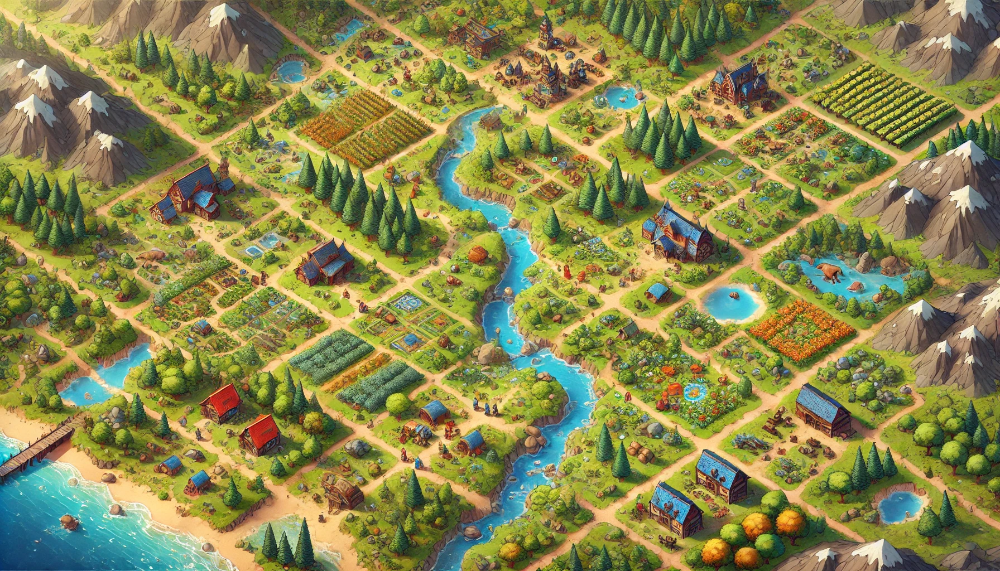

# Procedurally Generated Topdown Sandbox RPG

  
*A unique, ever-changing world at your fingertips*

## Project Overview

This project is a topdown sandbox RPG with a fully procedurally generated world, designed for both PC and mobile platforms. Players will find themselves in a **unique and constantly evolving world**, where every location, object, and event is created using **procedural generation algorithms**. The game world is filled with **interactive elements, dynamic events, and deep mechanics**, ensuring that each gameplay experience is one-of-a-kind.

The project focuses on:
- **Exploration**: Traverse an open world full of surprises.
- **Creativity**: Shape your own adventure.
- **Dynamic Gameplay**: Every session is different, with the world responding to player actions.

## Features

- **Procedurally Generated World**: No two playthroughs are the same.
- **Cross-Platform Play**: Available on both PC and mobile devices.
- **Interactive Environment**: Objects and locations adapt to the player’s choices.

## Authors

- **Michael Sharko** ([@michael_sharko](https://t.me/michael_sharko))
- **ChatGPT** (AI Collaborator)

---

### How to Play

1. Clone the repository.
2. Open the project in Unity.
3. Build the game for your desired platform (PC or mobile).
4. Enjoy the endless possibilities of a procedurally generated world!

---

*Stay tuned for more updates!*